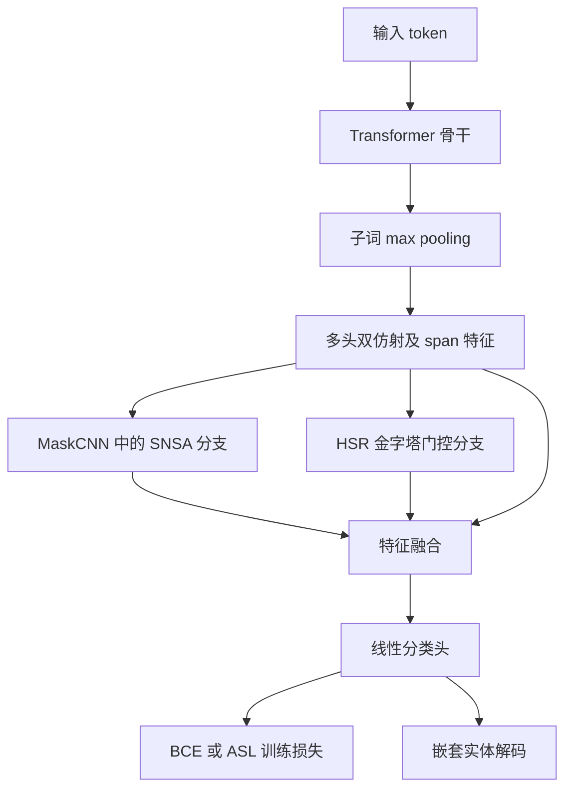

# SPSR-Net 代码备份

本仓库备份服务器上 SPSR-Net 的模型结构、训练、解码、评估、预处理源码及运行配置。备份日期为 **2026-10-07（Asia/Shanghai）**。

核心源码保持与服务器文件逐字节一致。这里保存的是代码与配置，恢复训练需要自行准备数据集和预训练骨干；恢复已训练模型的推理还需要对应 checkpoint。

## 文件结构

```text
model/                         模型、SNSA、HSR、双仿射、解码及指标
callbacks/                     PGD 对抗训练
data/ner_pipe.py                输入编码和数据加载
data/padder.py                  批处理填充
train.py                       原始训练入口
requirements                   原项目依赖
requirements-tools.txt         可选的 Excel 导出依赖
configs/genia_asl.json          GENIA：SNSA + HSR + PGD，ASL
configs/food_bce.json           FOOD legacy：SNSA + HSR + PGD，BCE
configs/historical_genia_checkpoint.json
                               历史 checkpoint 配置和来源信息，不含权重
scripts/train_from_config.py   可移植的配置启动入口
scripts/train/historical/      10 份原始实验启动、消融及续训脚本
scripts/                       骨干下载、评估、预测及消融结果收集
preprocess/*.py                原始数据转换源码
train_arg_*.sh                 原始 ACE/GENIA 启动脚本
docs/backup_manifest.json      原始文件路径、大小和 SHA-256
docs/server_environment.json   服务器实际依赖版本记录
docs/original/                 原始 README 及其 DiFiNet 示意图
```

没有备份数据集、数据划分清单、预训练权重、训练 checkpoint、缓存、训练日志、预测结果、实验表格或其他基线项目。`.gitignore` 保留 `data/*.py` 和 `preprocess/*.py`，排除对应目录中的数据文件。小型 JSON 配置与校验清单正常纳入 Git。

## 模型结构

SPSR-Net 面向嵌套命名实体识别。主模型类仍名为 `CNNNer`，位于 `model/model.py`。



`model/cnn.py` 组装特征网络，`model/cnn_liabrary.py` 实现 SNSA，`model/pyramid_bfm.py` 实现 HSR；`callbacks/adversarial.py` 实现训练时的 PGD。具体连接、层数和开关以源码及配置为准。`docs/original/images/model.png` 是沿用的 **DiFiNet 原始图**，不代表更新后的 SPSR 全部模块。

## 环境

服务器实际使用 Python **3.10.19**、PyTorch **2.3.0**、FastNLP **1.0.1**、Transformers **4.20.1**。完整已观测版本见 [server_environment.json](docs/server_environment.json)。原始 README 顶部列出的旧版本只作为历史资料保留。

```bash
conda create -n spsr python=3.10 -y
conda activate spsr
pip install torch==2.3.0 --index-url https://download.pytorch.org/whl/cu121
pip install torch-scatter==2.1.2 -f https://data.pyg.org/whl/torch-2.3.0+cu121.html
pip install -r requirements
# 需要生成消融 Excel 表格时再安装：
pip install -r requirements-tools.txt
```

服务器当前没有安装 `torch-scatter`，`model/model.py` 已有 PyTorch 2.x `scatter_reduce_` 后备实现。若采用同样环境，可跳过上面的 `torch-scatter` 安装，并从 `requirements` 中跳过这一项。

## 数据与骨干

训练目录应包含 `train.jsonlines`、`dev.jsonlines`、`test.jsonlines`。记录使用 `tokens` 和 `entity_mentions` 字段，具体格式、实体边界与编码规则见 `data/ner_pipe.py` 和各预处理脚本。GENIA 和 FOOD 的数据内容均未上传。

GENIA 配置记录骨干 ID `dmis-lab/biobert-v1.1`，FOOD 使用 `bert-base-chinese`。可以直接使用模型 ID，或将本地骨干目录传给 `--model-name`。

```bash
# 需要通过镜像下载 GENIA 骨干时：
python scripts/download_backbones.py --source wisemodel --groups genia \
  --wisemodel-endpoint https://hf-mirror.com
```

下载脚本原本支持 ACE/GENIA/CoNLL 组，不包含 FOOD；FOOD 骨干需另行下载或直接使用模型 ID。GENIA 下载脚本存在候选骨干回退，恢复既定实验时应确认实际下载的是配置要求的骨干。

## 运行

新启动入口根据仓库位置解析路径，不依赖原服务器的 Python 环境或缓存绝对路径。它只负责传递参数，原始 `train.py` 与模型实现保持不变。

```bash
# 先查看完整命令，不创建目录或执行训练：
python scripts/train_from_config.py --config configs/genia_asl.json --dry-run

# GENIA 完整模型：
python scripts/train_from_config.py --config configs/genia_asl.json \
  --data-dir /path/to/genia --model-name /path/to/biobert-v1.1 \
  --run-dir outputs/genia_asl_run1

# FOOD legacy 完整模型：
python scripts/train_from_config.py --config configs/food_bce.json \
  --data-dir /path/to/food --model-name /path/to/bert-base-chinese \
  --run-dir outputs/food_bce_run1

# FOOD 关闭 SNSA 的消融示例：
python scripts/train_from_config.py --config configs/food_bce.json \
  --data-dir /path/to/food --model-name /path/to/bert-base-chinese \
  --run-dir outputs/food_without_snsa -- --use_snsa 0
```

额外的 `train.py` 参数放在 `--` 后，会覆盖配置里的同名参数。配置沿用原实验的 FP16、batch size 和 PGD 参数，需使用合适的运行环境。启动入口拒绝复用已经存在的输出目录。

FOOD 配置来自原始脚本的 **legacy split**，保留历史 `--stop_at_test_f1 96.34` 设置；若需要关闭该设置，追加 `-- --stop_at_test_f1 0`。原脚本的 current split 对应另一个服务器数据目录，没有随仓库备份。

## 配置差异与历史脚本

- `configs/genia_asl.json` 提取自 `run_genia_spsr_direct_asl_perclass_20260921.sh`，显式使用 ASL；`configs/food_bce.json` 提取自 `run_food_spsr_bce_ablation_one.sh`，使用 BCE。
- 根目录原始 `train_arg_genia.sh` 未显式设置 `--loss_type`，因此当前训练入口会使用默认 **BCE**。它不能代表上述 ASL 实验。
- 训练入口的 `--separateness_rate 5` 会除以 100，传给模型的是 `0.05`。`size_embed_dim=25`、`kernel_size=3` 等固定参数也记录在配置里。
- 当前子词 pooling 默认是真正的 `max`。重现历史零截断推理时，显式使用 `legacy_zero_clamped`，详见 GENIA 预测导出脚本。
- `configs/historical_genia_checkpoint.json` 只保存历史 checkpoint 的来源与配置。它与当前 GENIA 训练 profile 是不同记录，也不包含 checkpoint 文件。
- `scripts/train/historical/` 中的脚本逐字节保留，仍包含原服务器路径、旧 checkpoint 路径及 `runs/...` 引用。它们用于保存原实验方法；直接运行前需要按本机位置调整路径。恢复常用训练可使用上面的配置启动入口。
- `preprocess/proGenia.py`、ACE 脚本依赖外部原始数据和划分清单；本次只备份处理逻辑。

## 评估与来源

`eval_per_class.py` 和 `eval_ensemble.py` 依赖同目录的 `eval_thresholds.py`，三者完整保留。`export_genia_full_sentence_predictions.py` 可导出 GENIA 预测；数据、骨干与 checkpoint 路径由参数提供。

项目是在 [DiFiNet（ACL 2024）](https://aclanthology.org/2024.acl-long.349/) 基础上发展的研究代码。原始项目说明、引用和致谢保存在 [原始 README](docs/original/README.md)。

所有直接复制的文件在 [backup_manifest.json](docs/backup_manifest.json) 中记录来源路径与 SHA-256；新写的 README、配置启动入口和排除规则单独列为整理文件。模型、训练、评估与历史实验脚本均可据此核对。
