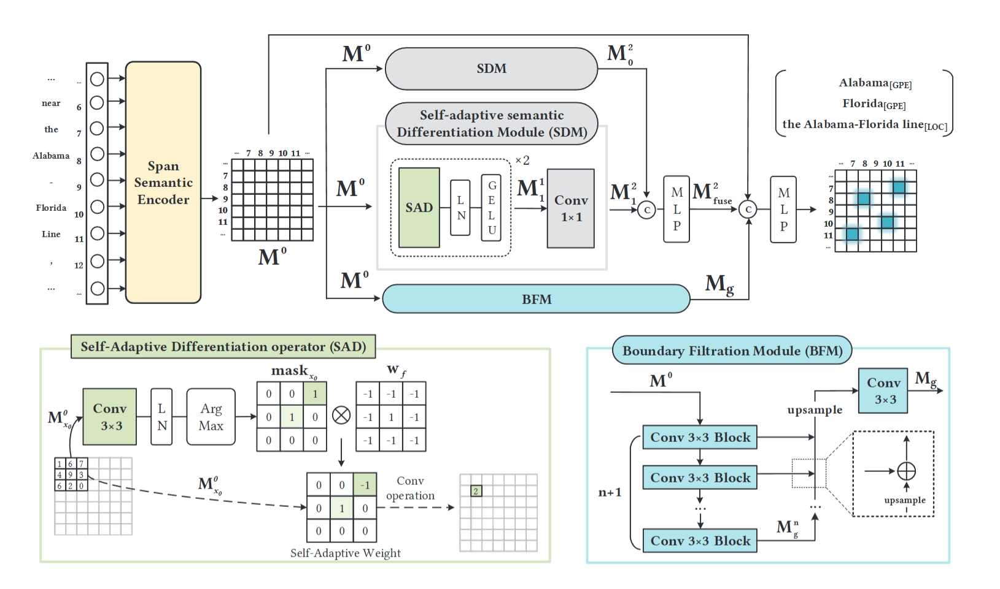

# SPSR-Net

## Overview

SPSR-Net is an improved research branch built on [DiFiNet: Boundary-Aware Semantic Differentiation and Filtration Network for Nested Named Entity Recognition](https://openreview.net/forum?id=zAig3Mmy1v), accepted by ACL 2024.



## Requirements

```
GPU=NVIDIA A100 Tensor Core
beautifulsoup4==4.9.3
FastNLP==1.0.1
fitlog==0.9.15
nltk==3.8.1
numpy==1.24.4
pandas==1.1.3
sparse==0.14.0
torch==1.13.1+cu117
torch_scatter==2.0.9
tqdm==4.65.0
transformers==4.20.1
```

## GENIA Inference Reproduction

Subword pooling defaults to a true maximum. The PyTorch fallback excludes the initial zero from reductions, so groups with only negative features keep their negative maximum. Empty groups remain zero.

`scripts/export_genia_full_sentence_predictions.py` uses the original FastNLP descending BPE-length batch order and `model.metrics_utils.decode`. Selected-sentence exports retain the full-test batch companions. Export metadata records checkpoint and data checksums, pooling mode, batch order, source-code checksums, and exact-match metrics.

- Use `--pooling-mode max --batch-order original --threshold 0.48 --batch-size 4` for the May 1, 2026 GitHub full checkpoint. Its reproduced test metrics are P=81.42%, R=82.20%, F1=81.81% on 1,854 sentences.
- Use `--pooling-mode legacy_zero_clamped` only when reproducing a checkpoint's recorded zero-clamped inference configuration. The September 12, 2026 joint checkpoint reproduces P=82.59%, R=80.40%, F1=81.48% with this explicit compatibility setting.
- Programmatic callers select compatibility behavior with `CNNNer(..., subword_pooling='legacy_zero_clamped')`; other callers retain the corrected default. The option adds no checkpoint tensors.

The full checkpoint uses ASL and true max pooling; the joint checkpoint uses BCE and historical zero-clamped inference. Their differences do not isolate SNSA or HSR effects. Regenerated predictions and provenance are in `analysis/genia_instance_comparison_20261002_corrected_pooling/`; the pooling audit is in `analysis/genia_pooling_audit_20261002/`.

## Deployment Without Direct HuggingFace Access

For network-restricted environments (cannot access HuggingFace directly), use local backbone download + local path training.

1. Create environment and install deps:
   ```bash
   conda create -n difinet python=3.10 -y
   conda activate difinet
   pip install --no-cache-dir torch==2.3.0 --index-url https://download.pytorch.org/whl/cu121
   pip install --no-cache-dir torch-scatter -f https://data.pyg.org/whl/torch-2.3.0+cu121.html
   pip install --no-cache-dir -r requirements
   ```

2. Download GENIA backbone model to `pretrained_models/`:
   ```bash
   python scripts/download_backbones.py \
     --source wisemodel \
     --groups genia \
     --wisemodel-endpoint https://hf-mirror.com
   ```

   If HF-compatible mirror is unavailable, you can fallback to ModelScope:
   ```bash
   python scripts/download_backbones.py --source modelscope --groups genia
   ```

3. Put GENIA preprocessed files in:
   ```text
   preprocess/outputs/genia/
   ```

4. Run training:
   ```bash
   bash train_arg_genia.sh
   ```

`train.py` will automatically prioritize local models under `pretrained_models/` for each dataset.

## Preprocess your datasets
Put ACE datasets in the `preprocess/data` directory, following a similar structure as demonstrated in [CNN_Nested_NER](https://github.com/yhcc/CNN_Nested_NER) 

For GENIA dataset, we use the version from [W2NER](https://github.com/ljynlp/W2NER)

## Train

   ```
   bash train_arg_{dataset}.sh
   ```
The item {dataset} can be replaced with "04", "05" or "genia". The experiment results can be found in the directory `logs` after initiating the training process.


## Citation
```
@inproceedings{cai-etal-2024-difinet,
    title = "{D}i{F}i{N}et: Boundary-Aware Semantic Differentiation and Filtration Network for Nested Named Entity Recognition",
    author = "Cai, Yuxiang  and
      Liu, Qiao  and
      Gan, Yanglei  and
      Lin, Run  and
      Li, Changlin  and
      Liu, Xueyi  and
      Luo, Da  and
      Jiaye, Yang",
    editor = "Ku, Lun-Wei  and
      Martins, Andre  and
      Srikumar, Vivek",
    booktitle = "Proceedings of the 62nd Annual Meeting of the Association for Computational Linguistics (Volume 1: Long Papers)",
    month = aug,
    year = "2024",
    address = "Bangkok, Thailand",
    publisher = "Association for Computational Linguistics",
    url = "https://aclanthology.org/2024.acl-long.349",
    pages = "6455--6471"
}
```
## Have any Questions？Please email cyx_yyy at foxmail dot com


## Acknowledge
The code of [CNN_Nested_NER](https://github.com/yhcc/CNN_Nested_NER)
